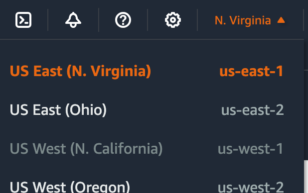
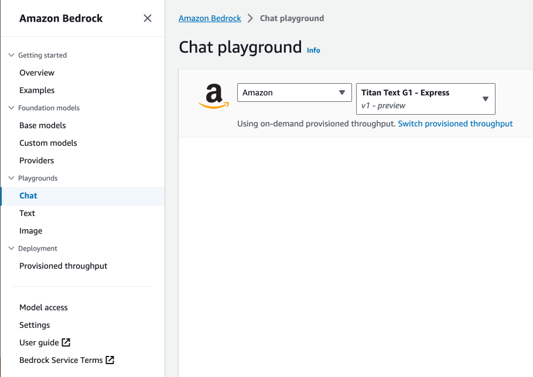
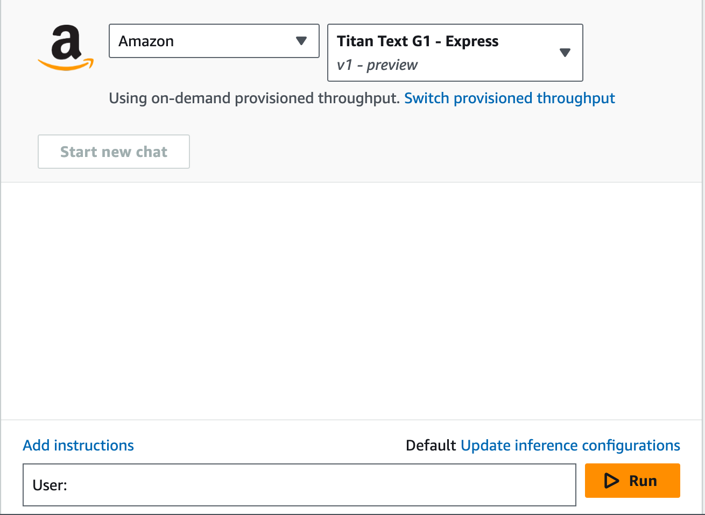
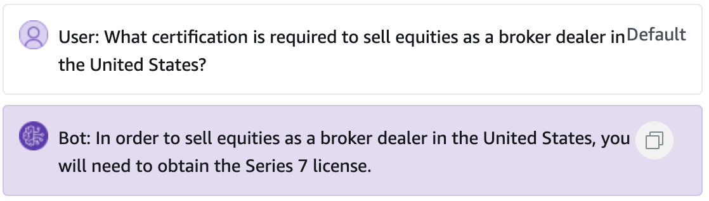
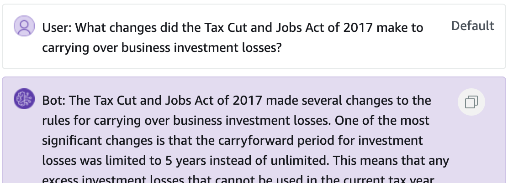
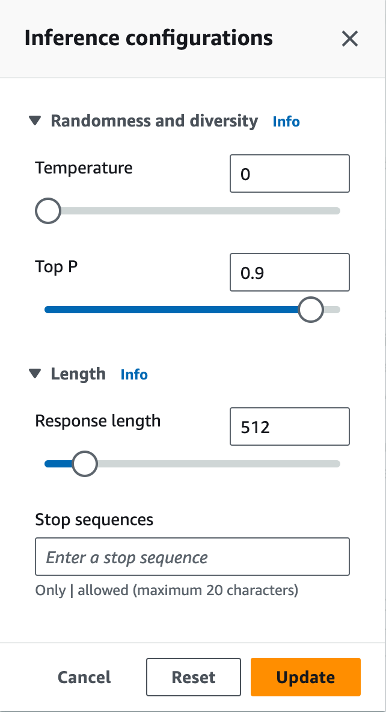
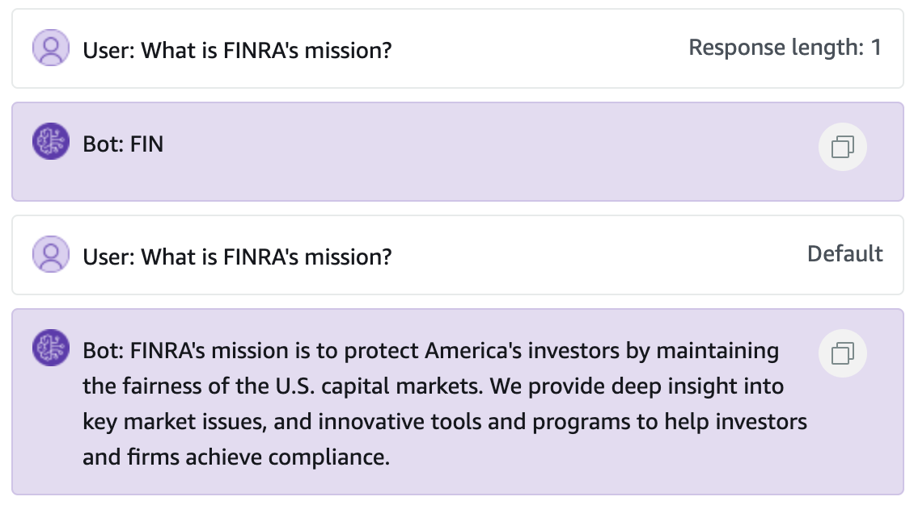

# Bedrock Console Demo 

Perhaps you've opened this lab and immediately thought 
> git, command lines, APIs...huh?
 
and are looking for a less technically involved workshop. Perhaps you have limited time but you're still interested in how large machine learning models work. Thankfully, Amazon Bedrock provides a console experience for you to interact with foundation models (FMs) like Amazon's Titan family or Anthropic's Claude family.

In this notebook, we'll walk you through the steps included in the individual modules for interacting with the models. You'll enter a prompt in the Bedrock playground, observing the model's response and determining the impact the inference parameters have on the the generated text. We'll follow along with the prompts that are included in the modules, pulling out the snippets where we interact with the models, and focus more on working in the console.

## Prerequisites

This notebook assumes you have access to the console in an AWS account for which you have Amazon Bedrock permissions. Please work with your AWS administrator to obtain appropriate access. You won't need any experience in large language models to complete this notebook, but having a general awareness of generative artificial intelligence can be helpful.

## Getting started

First, navigate in the console to the Bedrock Service page, found at this link:

[https://us-east-1.console.aws.amazon.com/bedrock/home](https://us-east-1.console.aws.amazon.com/bedrock/home)

Please note that the link above will send you to the console in the US East 1 (Northern Virginia) region. If you operate in a different region, please be sure to select the appropriate region from the top right corner of your console window, as seen in the picture below.

Once you've logged into the console and confirmed you're in the correct region, you can navigate to the playgrounds by finding them in the left hand menu, which can be expanded using the menu button in the top left corner.

There are three playgrounds within the Bedrock console:
- Chat: interactive near-realtime chat with a generative AI, streamed in the browser
- Text: longer form textual analysis and context driven Q&A
- Image: prompt based image generation

In this lab, we'll be working with the Chat and Text playgrounds, beginning with the Chat playground. Select it from the menu.

## Model Selection

Amazon Bedrock supports FMs from several organizations specializing in the development of artificial intelligence, such as Anthropic, Cohere, AI21, and Stability AI, along with Amazon's own Titan family of large language models. For this lab, we'll be using Amazon's Titan models.

1. Choose Amazon from the "Select model category" drop down menu.
2. Choose Titan Text G1 - Express from the "Select model" drop down menu.

This tells the console that you'd like to send your prompts to the `Titan Text G1 - Express` endpoint. Once you've configured your Chat playground and are ready to begin chatting, your window should look like this:

## 01_Generation

Start out by asking some questions of the model. 

For example, I asked a question about requirements for selling securities in the United States. When I hit run, I received this output from the model:

You can specify other requests or questions. For example, try prompting the model with:
- Please provide a list of ingredients for making apple pie.
- What is Number Six's famous line in the first episode of The Prisoner?
- Please show me a Python 3 implementation of dimensionality reduction via principal component analysis that does not include the sklearn Python module.

Try a few prompts of your own choosing. Keep in mind though--many of these models have a strong command of syntax and vocabulary, but may not have deep expertise in a given domain. As we'll see later, it can be helpful to provide instructions to the model about what to do when it doesn't know an answer. That way, we avoid [model hallucinations](https://en.wikipedia.org/wiki/Hallucination_(artificial_intelligence)), as you may already be aware of.

Another way to customize the model's response is by updating the inference parameters associated with the request. These parameters are described in the next section and tweak the model's performance.

## Common inference parameter definitions

### Randomness and Diversity

Foundation models support the following parameters to control randomness and diversity in the response.

##### Temperature
Large language models use probability construct the words in a sequence. For any given next word, there is a probability distribution of options for the next word in the sequence. When you set the temperature closer to zero, the model tends to select the higher-probability words. When you set the temperature further away from zero, the model may select a lower-probability word.

In technical terms, the temperature modulates the probability density function for the next tokens, implementing the temperature sampling technique. This parameter can deepen or flatten the density function curve. A lower value results in a steeper curve with more deterministic responses, and a higher value results in a flatter curve with more random responses.

##### Top-K 
Temperature defines the probability distribution of potential words, and Top K defines the cut off where the model no longer selects the words. For example, if K=50, the model selects from 50 of the most probable words that could be next in a given sequence. This reduces the probability that an unusual word gets selected next in a sequence. In technical terms, Top K is the number of the highest-probability vocabulary tokens to keep for Top-K-filtering - This limits the distribution of probable tokens, so the model chooses one of the highest probability tokens.

##### Top P
Top P defines a cut off based on the sum of probabilities of the potential choices. If you set Top P below 1.0, the model considers the most probable options and ignores less probable ones. Top P is similar to Top K, but instead of capping the number of choices, it caps choices based on the sum of their probabilities. For the example prompt "I hear the hoof beats of ," you may want the model to provide "horses," "zebras" or "unicorns" as the next word. If you set the temperature to its maximum, without capping Top K or Top P, you increase the probability of getting unusual results such as "unicorns." If you set the temperature to 0, you increase the probability of "horses." If you set a high temperature and set Top K or Top P to the maximum, you increase the probability of "horses" or "zebras," and decrease the probability of "unicorns."

### Length

The following parameters control the length of the generated response.

##### Response length
Configures the minimum and maximum number of tokens to use in the generated response.

##### Length penalty
Length penalty optimizes the model to be more concise in its output by penalizing longer responses. Length penalty differs from response length as the response length is a hard cut off for the minimum or maximum response length.

In technical terms, the length penalty penalizes the model exponentially for lengthy responses. 0.0 means no penalty. Set a value less than 0.0 for the model to generate longer sequences, or set a value greater than 0.0 for the model to produce shorter sequences.

### Repetitions

The following parameters help control repetition in the generated response.

##### Repetition penalty (presence penalty) 
Prevents repetitions of the same words (tokens) in responses. 1.0 means no penalty. Greater than 1.0 decreases repetition.

In the Chat playground, you'll see `Default` in the top right of the prompt box, reflecting that the prompt was sent to the Bedrock API using the default inference parameters.

Near the `Run` button, you'll see a link that says "Update inference configurations." Pressing that button opens up the window pictured below.

For example, the length of the response can be controlled using the length parameter. By setting it to `1`, you'll limit the response length to a single token--which will likely be part of the first word in the response. You'll also notice that the inference parameters used for a given inference are captured in the prompt box.

Setting the length parameter to a significantly higher number (perhaps all the way up to `4096`) will allow for longer answers. Keep in mind that a longer answer is not necessarily a higher quality answer, but each token does create an expense. In other words, as described above, choosing a response length that is both concise and appropriate in its level of detail is paramount for the cost efficiency of your generative applications.

Feel free to play around with the other parameters to see how they may impact the responses provided by the model.

